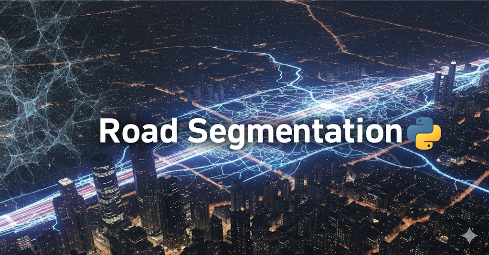
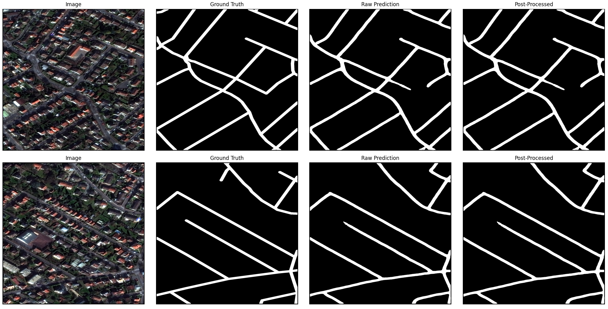
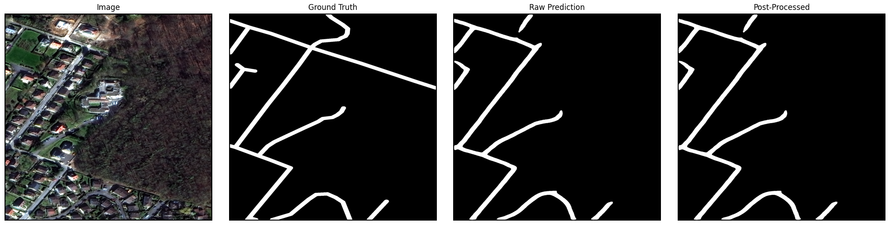
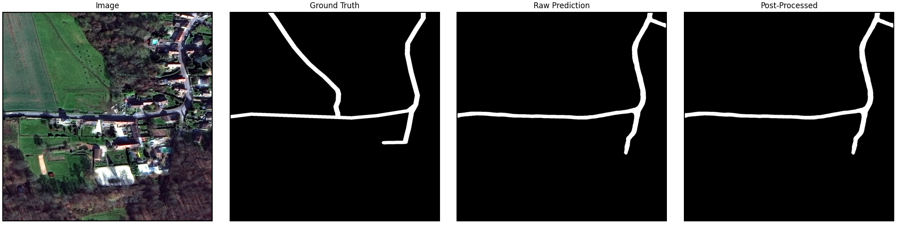
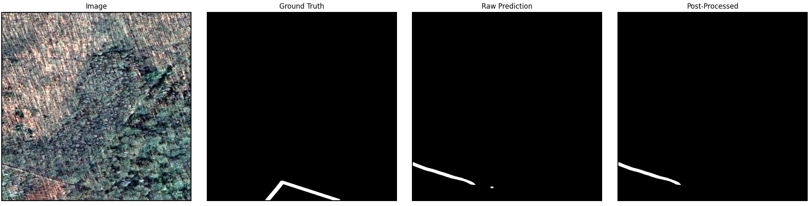
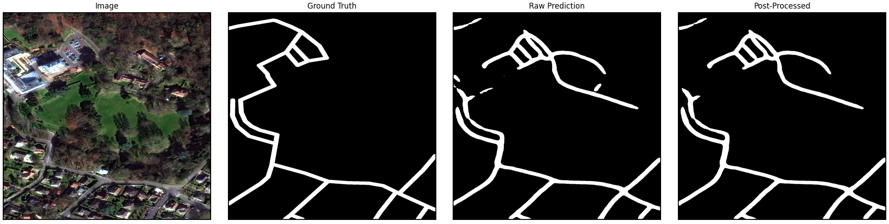

[](https://www.python.org/)[](https://pytorch.org/)[](LICENSE)

# 🛰️ End-to-End Deep Learning Pipeline for Road Network Extraction from Satellite Imagery

This project implements a complete, state-of-the-art deep learning pipeline for **semantic segmentation of road networks** from high-resolution satellite imagery. Using the **SpaceNet Roads Challenge dataset**, this work goes beyond a simple model implementation to tackle the complex, real-world challenges of **geospatial data processing, model optimization, and advanced post-processing** to generate clean, connected road graphs.

✅ The final model achieves a validation **IoU of ~0.60**, demonstrating strong performance in identifying road pixels.  
🛠️ More importantly, the project includes a **post-processing pipeline** to convert raw pixel-level predictions into a **topologically coherent road network**, suitable for real-world applications.



---

## 📚 Table of Contents

- [💡 Potential Applications](#-potential-applications)
- [🔎 The Journey: From a Failing Model to a Robust Pipeline](#-the-journey-from-a-failing-model-to-a-robust-pipeline)
  - [1. The Data Alignment Bug: What Worked](#1-the-data-alignment-bug-what-worked)
  - [2. Model & Training Optimization: What Worked and What Didn't](#2-model--training-optimization-what-worked-and-what-didnt)
  - [3. Advanced Post-Processing](#3-advanced-post-processing)
- [🤼‍♂️ The Struggles](#️-the-struggles)
- [🛠️ Future Work](#️-future-work)
- [📁 Repository Structure](#-repository-structure)
- [🚀 Getting Started](#-getting-started)
  - [Prerequisites](#prerequisites)
  - [Installation](#installation)
  - [Usage](#usage)
  - [💻 Technologies Used](#-technologies-used)


---

## 💡 Potential Applications

- This project demonstrates a complete workflow that is directly applicable to numerous real-world problems, including:

- Automated Mapping: Rapidly creating and updating road maps for areas where data is outdated or unavailable.

- Disaster Response: Quickly assessing road network damage and identifying accessible routes for emergency services.

- Urban Planning: Analyzing urban sprawl, traffic flow, and infrastructure development.

- Logistics and Routing: Providing the foundational data for optimized routing algorithms.

---

## 🔎 The Journey: From a Failing Model to a Robust Pipeline

A key part of this project was not just training a model, but systematically **debugging real-world issues**.  
The initial model failed to learn, achieving an **IoU score near zero**. The journey to a high-performing model involved solving several critical challenges.

---

### 1. The Data Alignment Bug: What Worked

**Problem:**  
The initial model was stuck at IoU = 0.0. Visualization showed **spatial misalignment** between ground truth masks and predictions. The model learned correct road shapes but in the wrong location.

**Solution:**  
The root cause was a **Coordinate Reference System (CRS)** mismatch between satellite `.tif` images and `.geojson` road masks.  

Fix: Re-engineered the `GeoImageDataset` class to:  

- Read CRS & affine transform from each satellite image.  
- Reproject road masks to match the image CRS.  
- Burn the mask onto the exact pixel grid.  

This **pixel-perfect alignment** was the single most important fix.

---

### 2. Model & Training Optimization: What Worked and What Didn't

With data fixed, the focus moved to **model architecture and training**.

✅ **What Worked:**  

- **Model:** U-Net + ResNet34 encoder (ImageNet pre-trained).  
- **Loss:** `0.8 * DiceLoss + 0.2 * BCEWithLogitsLoss` (balanced imbalance + boundary precision).  
- **Optimizer & Scheduler:** AdamW + CosineAnnealingLR.  
- **Augmentations:** Albumentations pipeline for robustness.  

❌ **What Didn’t Work:**  

- More complex models (U-Net++, DeepLabV3+) → harder to train, no better results.  
- More powerful encoders (EfficientNet-B4) → severe overfitting.  

---

### 3. Advanced Post-Processing

The raw U-Net predictions contained **gaps and noise**.  
The solution: a **multi-step refinement pipeline**.

1. Morphological Closing → fills small breaks.  
2. Small Object Removal → removes noise.  
3. Skeletonization → reduces to 1-pixel-wide centerlines.  
4. Graph Refinement → builds a graph with `sknw` to **connect gaps** and prune spurs.  

➡️ Final result: a **clean, topologically valid road network**.

---

## 🤼‍♂️ The Struggles

This model struggles with generating correct masks in some situations here are some examples of that :

1- The model might not predict well on areas that have alot of foliage or shadows



2- The model might not predict gravel roads as actual roads , although this isn't completely the models fault because the dataset is really incosistent with gravel roads or roads in rural areas as you can see in the first plot gravel is considered a road but in the 2nd plot it isn't




3- Some parking spaces could prove to be difficult to get an accurate prediction on



---

## 🛠️ Future Work

Improvements could include:

- Trying more complex models and encoders (with stronger GPU(s) so that we could train in a reasonable amount of time )
- Trying different augmentations
- Finding the actual optimal hyperparameters for a performance boost
- Using more bands for our model to train on , for this project only 3 bands (RGB) were used

---

## 📁 Repository Structure

```bash
food-101-classification/
├── assets/
├── checkpoints/
├── data/
├── logs/
├── notebooks/
├── scripts/
│   ├── main.py
│   ├── models.py
│   ├── evaluate.py
│   ├── utils.py
│   └── prepare_data.py
├── .gitignore
├── requirements.txt
└── README.md
```

---

## 🚀 Getting Started

### Prerequisites

- Python 3.12+ 🐍
- PyTorch 🔥
- CUDA-enabled GPU (recommended) 🎮

### Installation

1. **Clone the repository:**

    ```bash
    git clone https://github.com/Deathshot78/road_segmentation
    cd road_segmentation
    ```

2. **Install the dependencies:**

    ```bash
    pip install -r requirements.txt
    ```

### Usage

Run training with a subset for quick testing:

```bash
python main.py
```

---

### 💻 Technologies Used

- Python

- PyTorch

- PyTorch Lightning

- Matplotlib

- smp

- awscli

- rasterio
  
- geopandas
  
- albumentations
